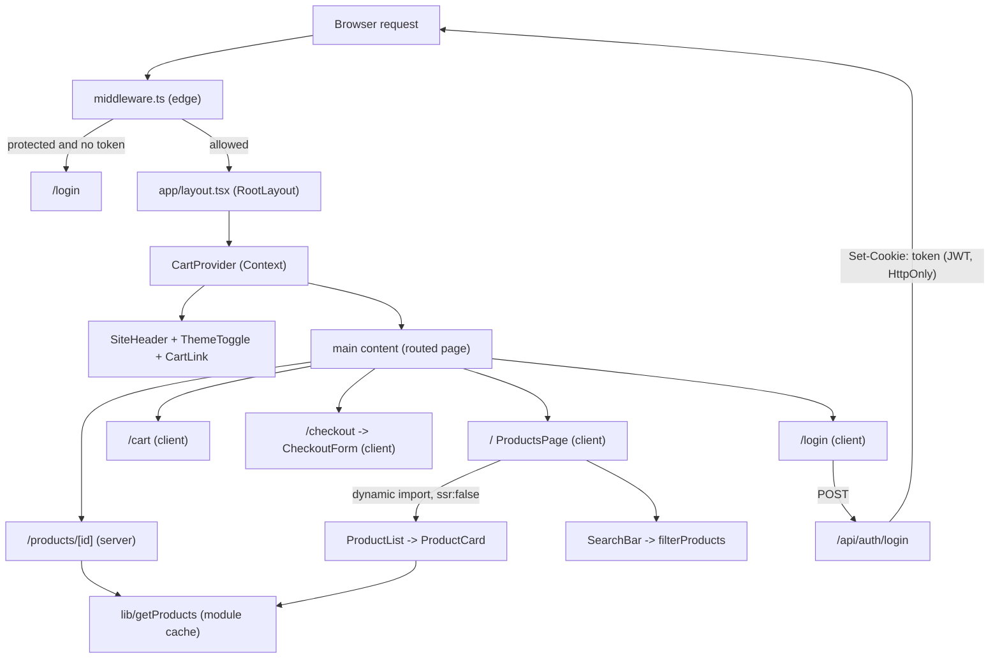
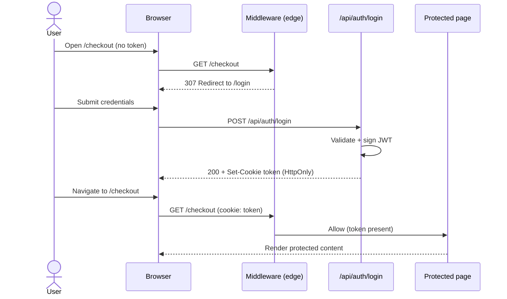

# MyShop — Modern Commerce Storefront

A production-style e-commerce storefront built with **Next.js 16 (App Router)**, **React 19**, **TypeScript**, and **Tailwind CSS v4**. It demonstrates a complete product browsing-to-checkout journey — catalog, search, product detail, an in-memory cart, a multi-step checkout, JWT cookie authentication with middleware-enforced route protection, light/dark theming, and a comprehensive Jest + React Testing Library suite. The codebase is intentionally structured to highlight separation of concerns, deliberate rendering choices (server vs. client components), and pragmatic performance optimizations.

---

## Table of Contents

- [Live Demo](#live-demo)
- [Screenshots](#screenshots)
- [Features](#features)
- [Tech Stack](#tech-stack)
- [Architecture Overview](#architecture-overview)
- [Project Structure](#project-structure)
- [Key Technical Decisions](#key-technical-decisions)
- [Authentication & Authorization](#authentication--authorization)
- [Performance Optimizations](#performance-optimizations)
- [SEO Strategy](#seo-strategy)
- [Testing Strategy](#testing-strategy)
- [Running Tests](#running-tests)
- [Installation](#installation)
- [Environment Variables](#environment-variables)
- [API / Data Layer](#api--data-layer)
- [UI/UX Considerations](#uiux-considerations)
- [Future Improvements](#future-improvements)
- [Tradeoffs & Assumptions](#tradeoffs--assumptions)
- [Development Notes](#development-notes)
- [License](#license)

---

## Live Demo

> **Deployment URL:** _Not yet deployed._ Add your production link here (e.g. a Vercel deployment) once available:
>
> `https://<your-deployment>.vercel.app`

---

## Screenshots

> Replace the placeholders below with real captures from `npm run dev`.

| View | Placeholder |
| --- | --- |
| Product catalog (home) | `` |
| Product detail | `` |
| Cart | `` |
| Multi-step checkout | `` |
| Login | `` |
| Dark mode | `` |

---

## Features

### Product Catalog
- Home page (`/`) renders a responsive product grid sourced from a local dataset.
- Each card shows a generated gradient visual, name, price, and a truncated (`line-clamp-2`) description.
- "Add to Cart" directly from the catalog card.

### Product Details
- Dynamic route `/products/[id]` rendered as an async **Server Component**.
- Looks up the product by id and calls `notFound()` for unknown ids (renders the custom 404 page).
- Larger hero visual, full description, price, stock badge, and an "Add to Cart" action.

### Search & Filtering
- Controlled `SearchBar` on the catalog page.
- Client-side, case-insensitive filtering across product **name** and **description** (`lib/filterProducts.ts`).
- Filtering is memoized and renders a contextual empty state when nothing matches.

### Shopping Cart
- Global cart via React Context (`CartProvider`): add, remove, and derived `count` / `total`.
- Quantity auto-increments when an existing item is re-added.
- Dedicated `/cart` page with line items, order summary, and an empty state.

### Multi-Step Checkout
- Three-step flow (Shipping → Payment → Review) plus a success screen (`CheckoutForm`).
- Per-step validation gates the "Next" button; an accessible progress bar (`role="progressbar"`) reflects completion.
- Review step masks the card number (`•••• last4`) before confirmation.

### Authentication
- Credential login via `POST /api/auth/login`, issuing a signed **JWT** stored in an **HTTP-only, SameSite=Strict** cookie.
- Logout via `POST /api/auth/logout`, which expires the cookie.

### Authorization & Protected Routes
- Edge middleware redirects unauthenticated users from protected routes (`/dashboard`, `/products`, `/products/[id]`, `/checkout`) to `/login`.
- Authenticated users visiting `/login` are redirected to home.

### Theming
- Light/dark mode toggle using `useSyncExternalStore`, persisted to `localStorage`.
- A blocking inline script applies the stored theme before paint to prevent a flash of incorrect theme (FOUC).

### Performance Optimizations
- Server Components by default, route-level code splitting via `next/dynamic`, memoization, module-level data caching, and `next/font` optimization. See [Performance Optimizations](#performance-optimizations).

### Testing
- Jest + React Testing Library across UI, pages, data utilities, API routes, and middleware, split into `jsdom` and `node` test projects.

### Responsive & Accessible Design
- Mobile-first Tailwind layout, skip-to-content link, semantic landmarks, ARIA labelling, and visible focus states.

---

## Tech Stack

| Category | Technology | Version | Purpose |
| --- | --- | --- | --- |
| Framework | [Next.js](https://nextjs.org) | `16.2.7` | App Router, Server Components, route handlers, middleware |
| UI library | [React](https://react.dev) | `19.2.4` | Component model, hooks, context |
| Language | [TypeScript](https://www.typescriptlang.org) | `^5` | End-to-end static typing |
| Styling | [Tailwind CSS](https://tailwindcss.com) | `^4` | Utility-first styling via `@tailwindcss/postcss` |
| Auth | [jsonwebtoken](https://github.com/auth0/node-jsonwebtoken) | `^9.0.3` | Signs/verifies JWTs in the login route |
| Icons | [lucide-react](https://lucide.dev) | `^1.17.0` | Iconography |
| Fonts | `next/font` (Geist, Geist Mono) | — | Self-hosted, optimized font loading |
| Test runner | [Jest](https://jestjs.io) | `^30.4.2` | Unit/integration tests, multi-project config |
| Testing (DOM) | [React Testing Library](https://testing-library.com) | `^16.3.2` | Behavior-focused component tests |
| Testing (matchers) | `@testing-library/jest-dom` | `^6.9.1` | DOM assertions |
| Testing (interaction) | `@testing-library/user-event` | `^14.6.1` | Realistic user interactions |
| Transpilation | Babel (`babel-jest`, presets) | `^7.29` | Test-time TS/JSX transform |
| Linting | ESLint + `eslint-config-next` | `^9` / `16.2.7` | Code quality |

---

## Architecture Overview

### App Router structure
The app uses the Next.js **App Router** (`app/` directory). The root layout (`app/layout.tsx`) wraps every route with the `CartProvider`, `SiteHeader`, a semantic `<main>` landmark, and a footer. Route-specific UI states are handled by file conventions: `loading.tsx` (Suspense fallback), `error.tsx` (error boundary), and `not-found.tsx` (404).

### Component organization
- **Route components** (`app/**/page.tsx`) compose features and decide server vs. client rendering.
- **Feature components** (`components/*`) implement domain behavior (catalog, cart, checkout, search, auth UI).
- **UI primitives** (`components/ui/*`) are presentational building blocks (`Button`, `Input`, `Card`, `Badge`, `Container`, `Skeleton`, `EmptyState`).

### Separation of concerns
- **Data access** lives in `lib/` (`getProducts`, `filterProducts`, `productVisuals`, `cn`) — pure, framework-agnostic, and independently testable.
- **Types** live in `types/` (`product`, `cart`, `form`) and are shared across UI and data layers.
- **Cross-cutting auth** lives at the edge in `middleware.ts`, isolated from page logic.

### State management approach
- **Server-derived data** (products) is read synchronously from a module-cached source — no global store required.
- **Cart** is the only truly global client state and uses **React Context** with `useCallback`/`useMemo` for stable references.
- **Local UI state** (search query, checkout step/form, password visibility) stays in the owning component via `useState`.
- **Theme** is external (the `<html>` class) and read through `useSyncExternalStore`.

### Routing strategy
- Static/dynamic pages via the App Router; product detail uses a dynamic `[id]` segment.
- Route protection is centralized in middleware rather than scattered per-page guards.



---

## Project Structure

```text
nextjs-dev-test/
├── app/
│   ├── layout.tsx              # Root layout: providers, header/footer, theme script, metadata
│   ├── page.tsx                # Home: product catalog + search (client)
│   ├── globals.css             # Tailwind v4 entry + design tokens (light/dark)
│   ├── loading.tsx             # Route-level loading skeleton
│   ├── error.tsx               # Route error boundary
│   ├── not-found.tsx           # Custom 404
│   ├── products/
│   │   └── [id]/page.tsx       # Product detail (async server component)
│   ├── login/page.tsx          # Login form (client)
│   ├── cart/page.tsx           # Cart view (client)
│   ├── checkout/page.tsx       # Checkout shell + metadata (server)
│   ├── protected/page.tsx      # Demo "authenticated" page
│   └── api/
│       └── auth/
│           ├── login/route.ts  # POST: validate credentials, issue JWT cookie
│           └── logout/route.ts # POST: clear JWT cookie
├── components/
│   ├── SiteHeader.tsx          # Sticky nav, theme toggle, cart link
│   ├── ProductList.tsx         # Filters + renders product grid (memoized)
│   ├── ProductCard.tsx         # Catalog card
│   ├── SearchBar.tsx           # Controlled search input
│   ├── AddToCartButton.tsx     # Cart action button
│   ├── CartLink.tsx            # Header cart link with live count
│   ├── CartProvider.tsx        # Cart context (state + derived totals)
│   ├── ThemeToggle.tsx         # Light/dark toggle (useSyncExternalStore)
│   ├── CheckoutForm.tsx        # Self-contained multi-step checkout
│   └── ui/                     # Reusable primitives (Button, Input, Card, Badge,
│                               #   Container, Skeleton, EmptyState)
├── lib/
│   ├── getProducts.ts          # Module-cached product accessor
│   ├── filterProducts.ts       # Pure search/filter utility
│   ├── productVisuals.ts       # Deterministic gradient + initial per product
│   └── cn.ts                   # className join helper
├── types/
│   ├── product.ts              # Product type
│   ├── cart.ts                 # CartItem type
│   └── form.ts                 # Checkout FormData type
├── data/
│   └── products.json           # Local product dataset
├── __tests__/
│   ├── app/                    # Page-level integration tests
│   ├── components/             # Component tests
│   ├── lib/                    # Utility unit tests
│   ├── api/auth/               # Route handler tests (node env)
│   └── middleware.test.ts      # Route-protection tests (node env)
├── middleware.ts               # Edge auth/route protection
├── jest.config.ts              # Multi-project Jest config (dom + api)
├── jest.setup.ts               # Test setup (jest-dom, polyfills)
├── babel.config.js             # Babel presets for jest transforms
├── next.config.ts              # Next.js config (defaults)
└── tsconfig.json               # TS config + `@/*` path alias
```

**Major folders at a glance**
- `app/` — routing, layouts, pages, route handlers, and route-state files.
- `components/` — feature components and a small design system under `components/ui/`.
- `lib/` — pure, testable logic with no React or Next.js dependency.
- `types/` — shared TypeScript contracts.
- `data/` — the product data source (static JSON).
- `__tests__/` — mirrors the source tree, grouped by layer.

---

## Key Technical Decisions

**Why the App Router.** Server Components are the default in modern Next.js, enabling data access close to the component (e.g. the product detail page reads data directly without a client fetch), file-based loading/error boundaries, and edge middleware. The App Router also makes the server/client boundary explicit, which keeps client bundles lean.

**Why React Context for the cart (not Redux/Zustand).** The only genuinely global, cross-route client state is the cart. Its surface area is small (items + a few actions), so Context with memoized values is the right-sized tool — it avoids an external dependency while still providing stable references via `useCallback`/`useMemo`. A heavier store would be unjustified complexity at this scope.

**Why local state for search and checkout.** Search query and checkout form data are owned by a single subtree and never needed elsewhere, so they live in component `useState`. Keeping them local avoids unnecessary global re-renders and keeps the components self-documenting.

**Why this folder structure.** Logic is separated by responsibility: `lib/` holds pure functions, `components/ui/` holds presentation, feature components compose them, and `types/` centralizes contracts. This makes units independently testable (note the `lib/` tests need no DOM) and keeps the dependency direction clean (UI depends on lib, never the reverse).

**Testing strategy decision.** A **multi-project Jest** setup runs DOM tests in `jsdom` and route/middleware tests in `node`, so each layer executes in a realistic environment. Tests are behavior-oriented (RTL queries by role/text) rather than implementation-coupled.

**Authentication strategy decision.** A **stateless JWT in an HTTP-only cookie** keeps auth simple and server-verifiable without a session store, while `HttpOnly` + `SameSite=Strict` mitigates XSS token theft and CSRF. Route protection is centralized in middleware so individual pages stay focused on rendering.

---

## Authentication & Authorization

### Login flow
1. The user submits email/password on `/login`.
2. The client `POST`s to `/api/auth/login`.
3. The route validates required fields, checks credentials against a mock user store, and on success signs a JWT (`{ id, email, role }`, `expiresIn: '1d'`).
4. The token is returned as an **HTTP-only** cookie (`token=...; HttpOnly; Path=/; Max-Age=86400; SameSite=Strict`).

### Session handling
- The session is fully represented by the signed JWT cookie — there is no server-side session store.
- Logout (`POST /api/auth/logout`) sets the cookie with `Max-Age=0`, expiring it immediately.

### Route protection & middleware behavior
- `middleware.ts` runs on every non-asset request (the matcher excludes `api`, `_next/static`, `_next/image`, `favicon.ico`).
- **Protected prefixes:** `/dashboard`, `/products` (including `/products/[id]`), `/checkout`. Requests without a `token` cookie are redirected to `/login`.
- **Auth route:** authenticated users hitting `/login` are redirected to `/`.
- The home catalog (`/`), `/cart`, and `/protected` are not gated by the matcher list. `/protected` is a demonstration page rather than a middleware-enforced route.

### User roles
- A `role` (`admin` or `user`) is embedded in the JWT for both demo accounts. The current middleware authorizes on **authentication only** (presence of a token); it does not yet branch on role. Role-based authorization is a documented [future improvement](#future-improvements).

> **Demo credentials:** `admin@test.com` / `password123` and `user@test.com` / `password123`.



---

## Performance Optimizations

> Honest note: this app renders product visuals as **generated CSS gradients** (deterministic per product id), not bitmap images, so `next/image` is intentionally **not** used. The optimizations below reflect what the codebase actually does.

- **Server Components by default.** Pages like `/products/[id]` and the `/checkout` shell render on the server, keeping data access and markup off the client bundle. *Why it matters:* less JavaScript shipped and faster first render.
- **Route-level code splitting via `next/dynamic`.** The catalog lazy-loads `ProductList` (`dynamic(() => import('@/components/ProductList'), { ssr: false, loading: <ProductGridSkeleton /> })`). *Why it matters:* the heavier grid is split into its own chunk and the page paints a skeleton immediately, improving perceived performance.
- **Lazy loading with graceful fallbacks.** The dynamic import’s `loading` state and the route-level `app/loading.tsx` show skeletons during navigation/Suspense. *Why it matters:* no layout shift or blank screen while chunks resolve.
- **Memoization.** `ProductList` memoizes filtering with `useMemo`; `CartProvider` memoizes `count`, `total`, and the context `value`; `CheckoutForm` memoizes validation and step handlers with `useMemo`/`useCallback`. *Why it matters:* avoids recomputation and prevents needless re-renders of context consumers.
- **Module-level data caching.** `lib/getProducts.ts` parses the dataset once into a module-scoped constant and returns the same reference on every call. *Why it matters:* zero repeated parsing and a stable reference that plays well with memoized consumers.
- **`next/font` optimization.** Geist and Geist Mono are loaded via `next/font/google` with CSS variables. *Why it matters:* self-hosted, preloaded fonts with no render-blocking external request and reduced CLS.
- **No-flash theming.** A tiny blocking inline script sets the theme class before hydration. *Why it matters:* eliminates a flash of incorrect theme without shipping a theming framework.

---

## SEO Strategy

- **Static metadata.** The root layout exports a `Metadata` object (title + description) applied site-wide.
- **Per-route metadata.** `/checkout` exports its own `Metadata` (`title`, `description`), demonstrating route-level overrides via the App Router metadata API.
- **Semantic HTML.** Documents use proper landmarks — `<header>`, `<nav aria-label="Main navigation">`, `<main id="main-content">`, `<footer>` — and a single `<h1>` per page with logical heading order.
- **Accessibility as SEO.** A skip-to-content link, `aria-hidden` on decorative icons/visuals, `aria-label`s on icon-only controls, `role="alert"` for errors, and a labelled `role="progressbar"` improve both assistive-tech and crawler comprehension.

> Note: product detail pages currently use static root metadata; per-product dynamic `generateMetadata` is listed under [Future Improvements](#future-improvements).

---

## Testing Strategy

### Philosophy
Tests favor **observable behavior over implementation details**: components are queried by role/label/text via React Testing Library, and utilities are tested as pure functions. Jest runs as **two projects** so each layer executes in a realistic environment:
- **`dom`** (`jsdom`): `__tests__/app`, `__tests__/components`, `__tests__/lib`.
- **`api`** (`node`): `__tests__/api`, `__tests__/middleware.test.ts`.

### Unit tests
- `lib/filterProducts` — matching by name/description, case-insensitivity, trimming, empty-query passthrough.
- `lib/getProducts` — returns the dataset and a stable cached reference.

### Component tests
- `ProductCard`, `ProductList`, `SearchBar`, `AddToCartButton`, `CartLink`, `CartProvider` — rendering, search/empty states, and cart interactions (add/remove, count/total).
- `CheckoutForm` — step navigation, validation gating, and the success transition.

### Integration / page tests
- `ProductsPage` (incl. the dynamic-import variant), `ProductDetailPage`, `CartPage`, `CheckoutPage`, and `LoginPage` exercise composed behavior across components.

### API & middleware tests
- `/api/auth/login` — missing fields (400), invalid credentials (401), success + `Set-Cookie` (200).
- `/api/auth/logout` — cookie expiry.
- `middleware` — public routes pass; unauthenticated access to `/dashboard`, `/products`, `/products/[id]`, `/checkout` redirects to `/login` (307); authenticated `/login` redirects to `/`.

### Example tested scenarios
- "Unauthenticated user is redirected from `/checkout` to `/login`."
- "Adding the same product twice increments its quantity rather than duplicating the line."
- "Searching for a non-existent term shows a contextual empty state."
- "Submitting login with invalid credentials surfaces an inline error alert."

---

## Running Tests

Exact scripts from `package.json`:

```bash
npm test            # run the full Jest suite (dom + api projects)
npm run test:watch  # watch mode
npm run test:coverage  # generate a coverage report
```

Coverage is collected from `app/`, `components/`, and `lib/` (excluding `.d.ts`), per `jest.config.ts`.

---

## Installation

**Prerequisites:** Node.js 18.18+ (Node 20+ recommended) and npm.

```bash
# 1. Install dependencies
npm install

# 2. Start the development server
npm run dev
# open http://localhost:3000

# 3. Lint
npm run lint

# 4. Production build & start
npm run build
npm start
```

---

## Environment Variables

No environment variables are **required** to run the project locally.

- `JWT_SECRET` *(optional)* — secret used to sign JWTs in `/api/auth/login`. If unset, it falls back to `'dev-secret-key'`. **Set a strong value in any deployed environment.**

```bash
# .env.local (optional)
JWT_SECRET=replace-with-a-strong-random-secret
```

---

## API / Data Layer

### Data source
Products come from a local static dataset, `data/products.json`, typed as `Product[]`. `lib/getProducts.ts` parses it once into a module-scoped cache and returns the same array reference on every call.

### Product fetching strategy
- **Catalog & detail** read synchronously from the cached accessor (no network round-trip), so server components can render immediately and client components can filter in memory.
- **Search/filter** runs client-side over the in-memory list via `lib/filterProducts.ts`.

### Auth API
Two route handlers under `app/api/auth/` implement login (issue JWT cookie) and logout (clear cookie) as documented above.

### Error handling strategy
- **Unknown product** → `notFound()` triggers the custom `not-found.tsx`.
- **Runtime render errors** → caught by the route `error.tsx` boundary, which logs the error and offers a recovery `reset()` action.
- **API validation** → the login route returns explicit `400`/`401` JSON with messages, which the login UI renders as an accessible alert.

---

## UI/UX Considerations

- **Responsive design.** Mobile-first Tailwind layout; the catalog grid scales from 1 → 4 columns across breakpoints, and navigation/checkout adapt for small screens. A shared `Container` standardizes max-widths.
- **Accessibility.** Skip-to-content link, semantic landmarks, `aria-label`s on icon-only buttons (theme toggle, password reveal), `aria-hidden` on decorative elements, visible `focus-visible` rings, and `role="alert"` / `role="progressbar"` where appropriate.
- **Loading states.** Route-level skeleton (`app/loading.tsx`) and a skeleton fallback for the dynamically imported product grid.
- **Empty states.** Reusable `EmptyState` for an empty cart and for "no products found," with contextual copy and a call to action.
- **Error states.** Friendly error boundary with retry, a custom 404, and inline form error messaging on login.
- **Theming.** Persistent light/dark mode with token-driven colors and no flash on load.

---

## Future Improvements

1. **Server-side search & filtering** with query params for shareable, deep-linkable result URLs.
2. **Product pagination / infinite scroll** for large catalogs.
3. **Persistent cart** (localStorage or backend) so it survives refresh and is shared across tabs.
4. **Wishlist / favorites.**
5. **Role-based authorization** — enforce `admin`-only areas using the `role` already present in the JWT, plus JWT signature verification in middleware.
6. **Dynamic per-product metadata** via `generateMetadata` and Open Graph/Twitter cards.
7. **Real backend & database** for products and users, replacing the static JSON and mock user store.
8. **`next/image` adoption** if/when real product imagery is introduced.
9. **End-to-end tests** (Playwright/Cypress) covering the full purchase journey.
10. **Analytics & conversion tracking** across catalog, cart, and checkout.
11. **Observability** — error monitoring (e.g. Sentry) and structured logging for the API routes.
12. **Payment integration** (e.g. Stripe) replacing the simulated payment step.
13. **Order history & account management.**
14. **Internationalization (i18n)** and currency formatting via the App Router i18n patterns.
15. **CI pipeline** running lint, type-check, and tests on every pull request.

---

## Tradeoffs & Assumptions

- **In-memory cart.** Implemented with Context and no persistence to keep the scope focused on architecture; it intentionally resets on refresh. Persistence is a documented follow-up.
- **Static JSON data source.** A local dataset avoids backend setup while still exercising real fetching/caching patterns. The accessor is abstracted (`getProducts`) so swapping in a database later is a localized change.
- **Lightweight middleware auth.** Middleware checks for the **presence** of the cookie rather than verifying the JWT signature, prioritizing a simple, fast edge check. Production hardening (signature verification, role checks) is listed under future work.
- **Generated visuals instead of images.** Deterministic gradients keep the repo dependency-free and avoid asset management; this is why `next/image` is absent rather than overlooked.
- **`ssr: false` for the product grid.** Chosen to demonstrate client-side code splitting and skeleton UX. For SEO-critical catalogs, server rendering the grid would be preferable — a conscious tradeoff for this exercise.
- **Mock authentication.** Credentials are validated against an in-file user list; no password hashing or persistence, suitable for demonstration only.

---

## Development Notes

What a reviewer may want to focus on:
- **Server vs. client boundaries.** Compare the async server `/products/[id]/page.tsx` with the client `app/page.tsx` and the rationale behind each.
- **State design.** `components/CartProvider.tsx` shows deliberate memoization to keep context consumers stable; local state is used elsewhere on purpose.
- **Edge auth.** `middleware.ts` plus the `__tests__/middleware.test.ts` suite document the exact protection rules (including the home/`/products` distinction).
- **Pure, testable logic.** `lib/filterProducts.ts` and `lib/getProducts.ts` are framework-free and covered by focused unit tests.
- **Testing setup.** `jest.config.ts` defines two projects (`dom`, `api`); note how API/middleware tests run in `node`.
- **Honest scope.** Items like `next/image`, JWT verification in middleware, and role-based authorization are intentionally deferred and called out rather than overstated.

> Some scaffolding files exist that are not part of the active runtime path (e.g. unused alternate checkout step components and placeholder modules). The live checkout flow is the self-contained `components/CheckoutForm.tsx`.

---

## License

Released under the **MIT License**.

```text
MIT License

Copyright (c) 2026

Permission is hereby granted, free of charge, to any person obtaining a copy
of this software and associated documentation files (the "Software"), to deal
in the Software without restriction, including without limitation the rights
to use, copy, modify, merge, publish, distribute, sublicense, and/or sell
copies of the Software, and to permit persons to whom the Software is
furnished to do so, subject to the following conditions:

The above copyright notice and this permission notice shall be included in all
copies or substantial portions of the Software.

THE SOFTWARE IS PROVIDED "AS IS", WITHOUT WARRANTY OF ANY KIND, EXPRESS OR
IMPLIED, INCLUDING BUT NOT LIMITED TO THE WARRANTIES OF MERCHANTABILITY,
FITNESS FOR A PARTICULAR PURPOSE AND NONINFRINGEMENT. IN NO EVENT SHALL THE
AUTHORS OR COPYRIGHT HOLDERS BE LIABLE FOR ANY CLAIM, DAMAGES OR OTHER
LIABILITY, WHETHER IN AN ACTION OF CONTRACT, TORT OR OTHERWISE, ARISING FROM,
OUT OF OR IN CONNECTION WITH THE SOFTWARE OR THE USE OR OTHER DEALINGS IN THE
SOFTWARE.
```
